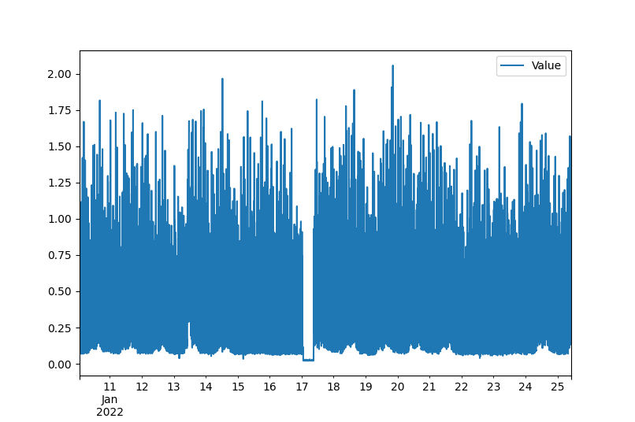

## Anonymized CPU usage dataset

This dataset contains anonymized CPU usage data from a cluster of production Kubernetes pods, between the dates of **10th of January 2022** and **25th of January 2022**.

The `prom_parser.py` script allows you to turn the Prometheus metrics into a Pandas data frame that you can then use in your analysis.

### Data description

The data consists of CPU usage metrics over 15 days, collected using the following Prometheus query:

```promql
sum(rate(
process_cpu_seconds_total{
  kubernetes_namespace =~
  "api-process"}[5m]
  )
)
```

Basically, this means we measure a rolling window of the rate of change in CPU usage. The window is 5 minutes, so each metric is 5 minutes apart.

These are the first 5 rows in the dataset:

```
                 Time     Value
0 2022-01-10 01:05:00  0.082057
1 2022-01-10 01:10:00  0.312971
2 2022-01-10 01:15:00  0.712057
3 2022-01-10 01:20:00  0.246171
4 2022-01-10 01:25:00  0.875086
```

Additionally, one can find a small outage in the data around midnight on the 17th of January. See the image below.


